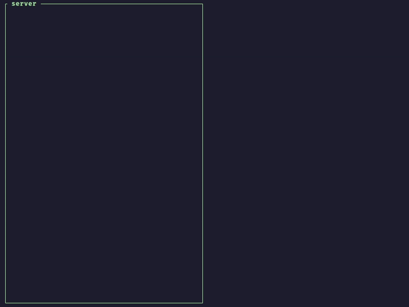

# <div align="center">Secret Handshake over Untrusted Network</div>

Proof of Concept for the Handshake Protocol defined in the Blog. Contains a server and a client binary that perform a handshake over TCP

The Protocol uses ECDSA, ECDSA and AES to preform a Secret Handshake over Untrusted Network. The [NIST P-256](https://neuromancer.sk/std/nist/P-256) curve has been used for both ECDSA and ECDH. The AES-256 variant has been used for encryption

## Demo

Run the Server
```sh
cargo run --bin server
```

Run the Client
```sh
cargo run --bin client
```

